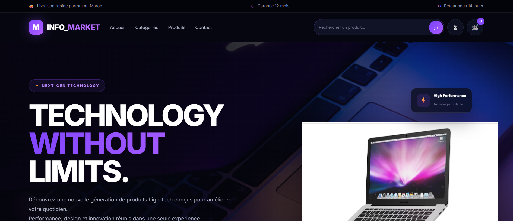
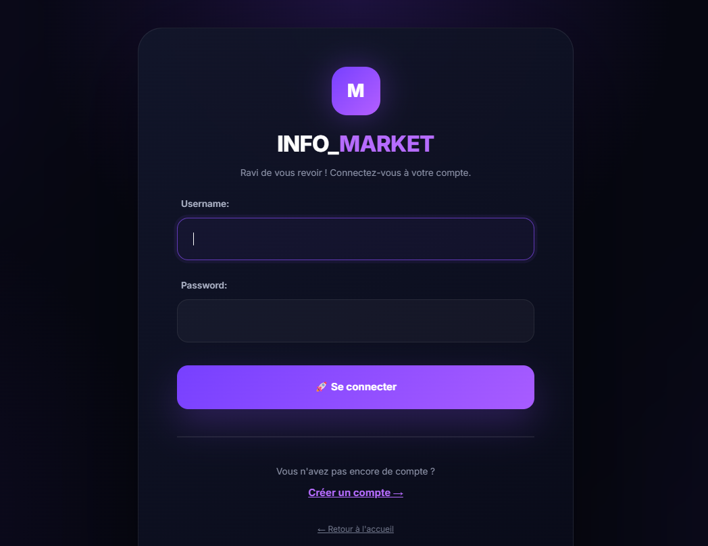
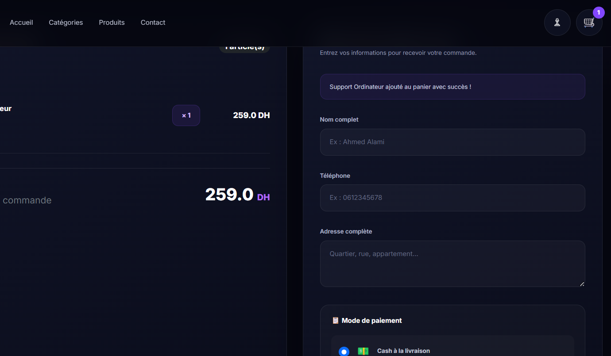

# INFO_MARKET 🛒

A full-stack e-commerce web application built with **Django and MySQL**.

## 📌 About the Project

INFO_MARKET is an e-commerce platform developed with Django. The project allows users to browse products, create accounts, manage their shopping cart, and interact with the online store.

The application was developed as a practical project to improve skills in backend development, database management, frontend integration, and web application development.

## ✨ Features

* User registration and authentication
* User login and logout
* Product listing
* Product categories
* Product details
* Shopping cart
* Add and remove products from the cart
* Product comments
* Contact page
* Django administration panel
* MySQL database integration
* Product image management
* Automated product import using a Python scraper
* Responsive web interface

## 🛠️ Technologies Used

### Backend

* Python
* Django

### Frontend

* HTML5
* CSS3
* JavaScript

### Database

* MySQL

### Development Tools

* Visual Studio Code
* Git
* GitHub
* XAMPP

## 📂 Project Structure

```text
INFO_MARKET/
│
├── ecommerce/
│   ├── settings.py
│   ├── urls.py
│   ├── asgi.py
│   └── wsgi.py
│
├── shop/
│   ├── migrations/
│   ├── templates/
│   ├── admin.py
│   ├── models.py
│   ├── urls.py
│   ├── views.py
│   └── tests.py
│
├── media/
├── manage.py
├── requirements.txt
├── run_scraper.py
├── .gitignore
└── README.md
```

## ⚙️ Installation

### 1. Clone the repository

```bash
git clone https://github.com/kelkorfa9078/INFO_MARKET.git
cd INFO_MARKET
```

### 2. Create a virtual environment

```bash
python -m venv venv
```

### 3. Activate the virtual environment

On Windows:

```powershell
venv\Scripts\activate
```

### 4. Install dependencies

```bash
pip install -r requirements.txt
```

### 5. Configure the database

Make sure MySQL is running through XAMPP.

Create your database and configure the database settings in:

```text
ecommerce/settings.py
```

### 6. Apply migrations

```bash
python manage.py migrate
```

### 7. Create an administrator account

```bash
python manage.py createsuperuser
```

### 8. Run the development server

```bash
python manage.py runserver
```

Then open:

```text
http://127.0.0.1:8000/
```

## 🔐 Environment Variables

For production, sensitive information such as database credentials and secret keys should be stored in environment variables instead of being written directly in the source code.

Example:

```text
SECRET_KEY=your_secret_key
DEBUG=False
DB_NAME=your_database
DB_USER=your_database_user
DB_PASSWORD=your_database_password
```

**Never commit passwords, API keys, secret keys, or other sensitive information to GitHub.**

## 🗄️ Database

The project uses **MySQL** as its database management system.

Django migrations are included in the project to create and update the required database tables.

The project uses Django ORM to interact with the database.

## 🕷️ Product Scraper

The project includes a Python scraper located in:

```text
run_scraper.py
```

The scraper is used to automate product data collection and import product information into the application database.

## 📸 Screenshots

Screenshots of the application can be added here to showcase the main pages and features.

### 🏠 Home Page



### 🛍️ Products Page


### 🔐 Login Page



### 🛒 Shopping Cart & Checkout



## 🚀 Future Improvements

Possible future improvements include:

* Online payment integration
* Order management
* Product search and filtering
* Wishlist functionality
* Email notifications
* Improved responsive design
* REST API
* Deployment to a production server

## 👩‍💻 Author

**Khadija EL KORFA**

GitHub: [kelkorfa9078](https://github.com/kelkorfa9078)

## 📄 License

This project was created for educational and development purposes.
